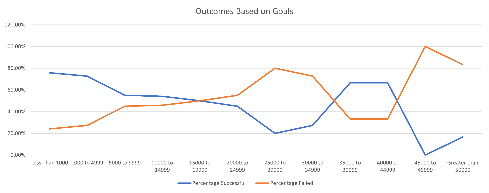
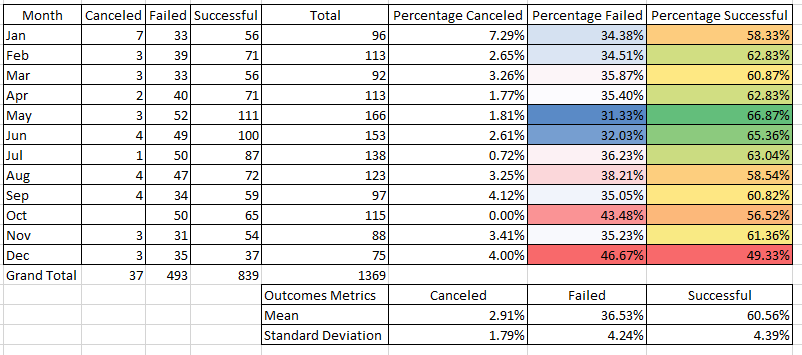

# An Analysis of Kickstarter Campaigns 
## Performing analysis on Kickstarter data to uncover trends.
### To help Louise analyze how different Kickstarter campaigns fared in relation to their launch dates, this analysis is an effort in understanding how different campaigns fared based on their respective launch dates and funding goals.  Please refer to the [Kickstarter_Challenge.xlsb](Kickstarter_Challenge.xlsb) for reference.
### Challenges Encountered
This was the first time I utilized GitHub so there is a learning curve involved with formatting and uploading data properly.  Utilizing the CountIFs function in excel was also a new endeavor for me as well and nesting functions also posed some time sinks.

## Results of Analysis
### Conclusions about Outcomes Based on Launch Date Data

The raw data of theater outcomes based on launch date shows that the months of May and June have the highest successful outcomes.  Interestingly, the months of May, July, October and June have the highest number of failed outcomes.  This speaks to the volume of the number of Kickstarter Theater campaigns that occur during the summer months of May – July.  However, there does seem to be a spike in failure rates starting in October which may signal a seasonality trend.  One explanation for the seasonality effect is the disposable income for businesses and people in general seem to decrease as the calendar year expires. This will be demonstrated more optimally in a later visualization.

### Conclusions about Outcomes Based on Goals

The dataset suggests that Kickstarter campaigns with goals from less than $1000 and $1000 to $4999 have a much higher success rate than campaigns with higher goal ranges.  The percentage of campaigns increases dramatically from the $5000 range and up.  However, most of the campaigns have goals less than $9999.  A simple calculation shows that 85.23% of the Kickstarter campaigns are comprised of goals with under $10000.  There are successful campaigns with good success rates in the $35000-$39999 and $40000 to $44999 ranges, but the raw data suggests there is not enough data points (9 total in a set of 1043 data points) that suggest these success rates are not statistically significant.

### Limitations on the Dataset
Although the analysis was unable to unearth some handy trends and conclusions, there are some limitations.  For instance, in the Outcomes_vs_Goals data set, there is no entry accounting for the $50,000 goal amount - this is strangely omitted by the analysis, which had 6 occurrences and is significant for this limited amount of entries for this high goal amount.  The analysis could also have tested the which effect seasonality, goal amount by stratifying the data.  For instance, did Kickstarter theater campaigns with goals under $10000 fare well in the summer months versus the end of the year?  

### More Optimal Visualizations
To illustrate the seasonality trend with a more descriptive visualization, I would use percentage data by theater outcomes and their respective month’s launch date as shown below along with mean and standard deviation calculations.  The mean successful percentage is 60.56% for all months, and the months of May and June also show the highest percentage of successful outcomes with 66.87% and 65.36%, respectfully.  Technically, May, June and July along with October shows the most failed outcomes by raw data due to sheer volume - however a closer look reveals that by percentage December has the highest percentage of failed outcomes at 46.67%.  This is statistically significant because the mean failure rate is 36.53% +/- 4.24% standard deviation for all months, which means the month of December is above the mean failure rate over 2 standard deviations.
[Percentages_Theater_Outcomes_by_Launch_Date](https://github.com/jpmendeziii/kickstarter-analysis/blob/main/Percentages_Theater_Outcomes_by_Launch_Date.xlsx)

