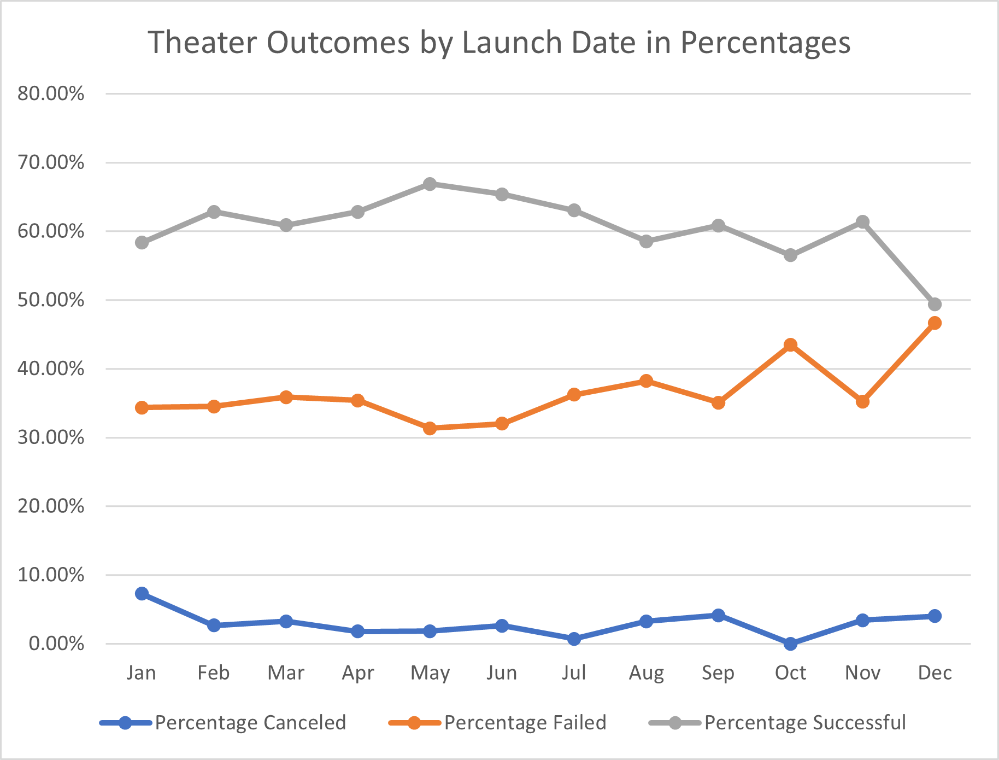

# An Analysis of Kickstarter Campaigns 
## Performing analysis on Kickstarter data to uncover trends.
### Conclusions about Outcomes Based on Launch Date Data

The raw data of theater outcomes based on launch date shows that the months of May and June have the highest successful outcomes.  Interestingly, the months of May, July, October and June have the highest number of failed outcomes.  This speaks to the volume of the number of Kickstarter Theater campaigns that occur during the summer months of May – July.  However, there does seem to be a spike in failure rates starting in October which may signal a seasonality trend.  One explanation for the seasonality effect is the disposable income for businesses and people in general seem to decrease as the calendar year expires. This will be demonstrated more optimally in a later visualization.
### Conclusions about Outcomes Based on Goals

### Limitations on the Dataset

### More Optimal Visualizations
To illustrate the seasonality trend with a more descriptive visualization, I would use percentage data by theater outcomes and their respective month’s launch date as shown below along with mean and standard deviation calculations.  The mean successful percentage is 60.56% for all months, and the months of May and June also show the highest percentage of successful outcomes with 66.87% and 65.36%, respectfully.  Technically, May, June and July along with October shows the most failed outcomes by raw data due to sheer volume - however a closer look reveals that by percentage December has the highest percentage of failed outcomes at 46.67%.  This is statistically significant because the mean failure rate is 36.53% +/- 4.24% standard deviation for all months, which means the month of December is above the mean failure rate over 2 standard deviations.
[Percentages_Theater_Outcomes_by_Launch_Date](https://github.com/jpmendeziii/kickstarter-analysis/blob/main/Percentages_Theater_Outcomes_by_Launch_Date.xlsx)

